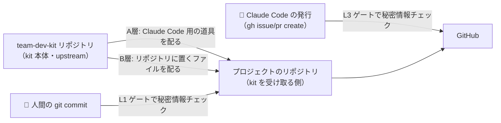
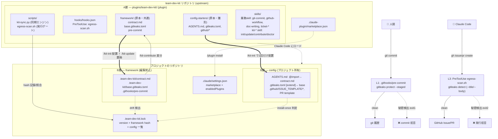
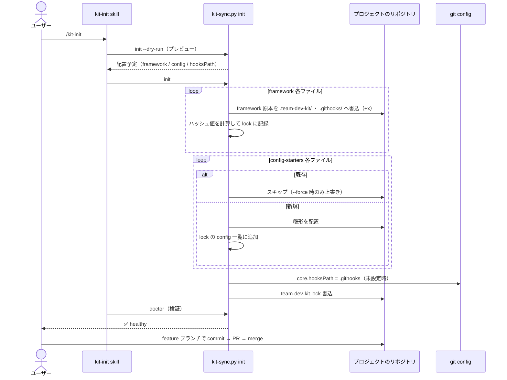
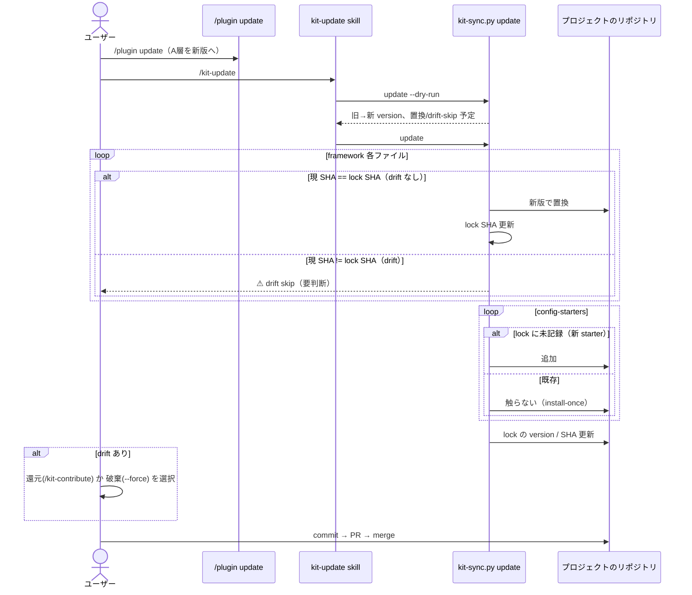
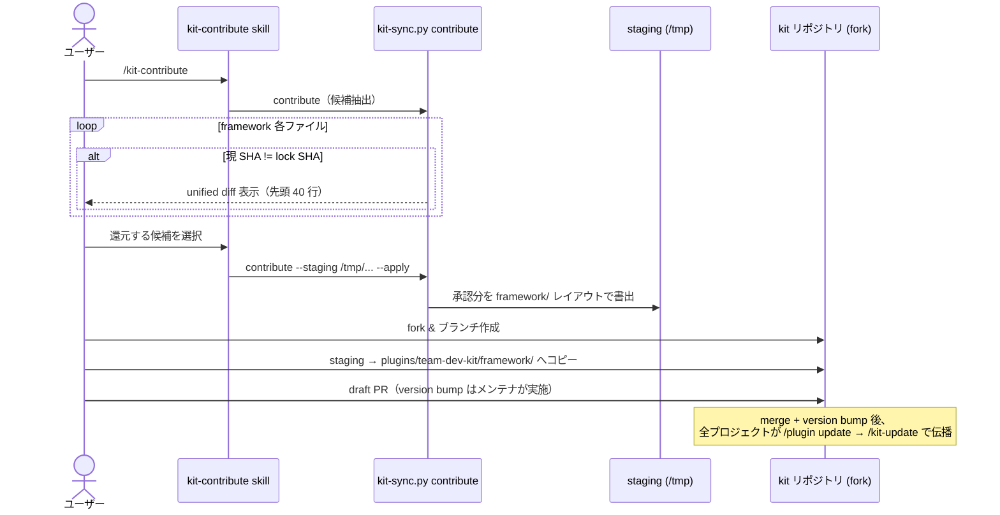
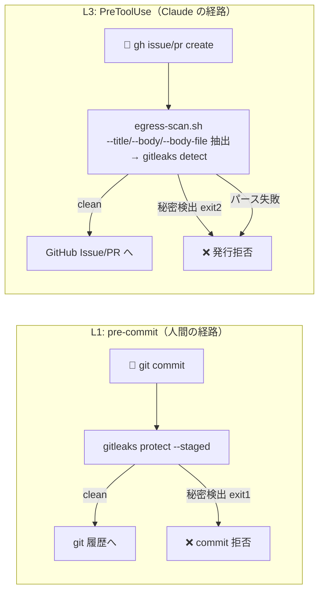

# team-dev-kit アーキテクチャ

チーム開発の **決まりごと（ルール・ワークフロー）と人為ミス排除のガードレール** を、Claude Code を前提に
多数のリポジトリへ配り、更新し、現場の改善を吸い上げる kit。本ドキュメントは設計全体像・構成要素・
データフローをまとめる。

## 1. 設計の狙い

- **オンボーディングの即時化** — ルールを知らない初心者が clone 直後からルール通りに開発を始められる
- **人為ミスの排除** — 秘密情報・個人情報の漏洩を、人間の `git commit`（pre-commit）と Claude の外部発行
  （PreToolUse フック）の二経路で機械的に止める

## 2. いちばん大事な考え方: 2つの層（A層・B層）

この kit が配るものは、大きく **2つの層** に分かれている。

- **A層** = Claude Code が利用する道具の層
- **B層** = プロジェクトのリポジトリに配置され、人間の `git commit` と GitHub に効かせる層

なぜ層を分けるのか。「誰に効かせるか」「どう配って、どう更新するか」が両者でまったく違うからである。
ひとつにまとめると、片方だけ直したいときにもう片方まで壊しかねない。だから最初から別々にしている。

層を分けず、A層とB層を同じディレクトリにまとめて配る案も検討した。配布経路が 1 本で済む利点はあるが、
A層は Claude Code に渡す道具なのでリポジトリの履歴に残したくない一方、B層は clone した全員のリポジトリに
残らないと意味がない。この正反対の要求を同時に満たせないため、まとめる案は捨てた。失うものは配布経路の単純さ、
得るものは「片方を更新しても、もう片方を壊さない」独立性である。

| | A層（Claude Code が利用する） | B層（プロジェクトのリポジトリに配置される） |
|---|---|---|
| 配布 | plugin marketplace | `git commit` |
| 更新 | `/plugin update`（ネイティブ） | `/kit-update`（framework 置換）/ install-once（config） |
| 配置先 | plugin 配下（リポジトリツリー外） | `.team-dev-kit/`, `.githooks/`, `AGENTS.md`, `.gitleaks.toml`, `.github/` |
| 効かせる相手 | Claude Code | 人間の `git commit`・GitHub |
| 中身 | skill・PreToolUse フック・同期エンジン・テンプレ原本 | framework（共通・編集禁止）・config（プロジェクト所有） |

**もう少しかみくだく**: A層は Claude Code に「やり方」を教える道具なので、リポジトリの履歴に残さず、
すぐ使える状態で届けたい。B層は人間の commit や GitHub への投稿をその場で止める番人なので、
リポジトリに置いて clone した人全員に残らないと意味がない。役割が逆向きなので一緒にできない。

### B層はさらに 2 種類: framework と config

B層の中身も「全員で共有して触らないもの（framework）」と「各プロジェクトが自由に書くもの（config）」に
分かれる。理由は同じで、勝手に上書きしてよいか／ダメかが正反対だからである。

| | framework（共通・編集禁止） | config（プロジェクトが書く・install-once） |
|---|---|---|
| 所有 | kit | プロジェクト |
| 編集 | 禁止（契約違反） | 期待・推奨 |
| 更新 | `/kit-update` が**置換**（3-way merge なし） | kit は再配置しない（新規 starter のみ追加） |
| 還元 | `/kit-contribute` で kit へ PR | 還元しない（プロジェクト固有） |
| 例 | `contract.md`, `base.gitleaks.toml`, `pre-commit` | `AGENTS.md`, `.gitleaks.toml`, `.github/*` |

この 2 種類を裏でつなぐ仕組み（**glue＝のりづけ役**）は、読む相手によって 2 通り使い分ける:

- **`@import`**（agent 向け契約）: `AGENTS.md` が `@.team-dev-kit/contract.md` を取り込む
- **`[extend].path`**（gitleaks）: `.gitleaks.toml` が `.team-dev-kit/base.gitleaks.toml` を extend

これで framework は誰も触らず置換で更新でき、config は kit が触らない。

## 3. 全体像

詳細図に入る前に、登場人物と流れだけを示す。kit 本体（upstream）が A層・B層の両方を配り、
各プロジェクトのリポジトリがそれを受け取る。受け取ったあと、人間の commit と Claude Code の発行は
それぞれ別のゲートで秘密情報をチェックされる。



A層は「Claude Code に渡す道具」、B層は「リポジトリに置くファイル」。次節以降の図はこの 2 つを
さらに分解したものなので、迷ったらこの全体像に戻ること。

## 4. 詳細ダイアグラム

次の図は全体像の各要素を実ファイル名まで展開したものである。初読では「A層＝plugin 配下」「B層＝
プロジェクトのリポジトリ配下」「下半分＝2 つの秘密情報ゲート」の 3 ブロックに分かれている、とだけ
押さえれば足りる。



## 5. 構成要素

ここでは A層・B層それぞれが何のファイルでできているかを、初めて読む人向けに役割つきで並べる。
表だけ見て役割が分からない箇所には、表の下に補足を足してある。

### 5.1 A層 — plugin (`plugins/team-dev-kit/`)

A層は Claude Code が読み込む plugin である。「Claude Code への指示書（skill）」「Claude Code が外部へ
発行する前に走る検査（PreToolUse フック）」「B層のファイルを配置・更新するプログラム（同期エンジン）」
「B層に配る元ファイル（原本）」の 4 種類でできている。

| パス | 役割 |
|------|------|
| `.claude-plugin/plugin.json` | plugin のメタ情報（名前・version・skill ディレクトリ・hooks ファイルの場所） |
| `skills/` | 11 個の skill。skill とは Claude Code への指示書で、実行コードは持たない |
| `hooks/hooks.json` | PreToolUse フックの定義。Bash 実行の直前に `egress-scan.sh` を走らせる設定 |
| `scripts/kit-sync.py` | B層を配置・更新する同期エンジン。`/kit-init` などの実体 |
| `scripts/egress-scan.sh` | L3 ゲートの本体。`gh issue/pr create` の本文を gitleaks で検査 |
| `framework/` | B層に配る共通ファイルの**原本**（プロジェクト側では編集禁止） |
| `config-starters/` | B層に 1 回だけ置く雛形の**原本**（置いた後はプロジェクトが所有） |

skill は発火のしかたで 2 種類に分かれる。普段の開発で使うものは条件がそろうと自動で立ち上がり、
kit 自体を操作するものは取り違えを防ぐため `/kit-*` と明示的に打ったときだけ立ち上がる。

- 業務 skill（条件発火）: `git-commit`, `github-workflow`, `doc-writing`, `ticket-draft`,
  `ticket-template`, `ticket-publish`, `ticket-pr-publish`
- kit-* skill（`/kit-*` 明示発火のみ・誤爆防止）: `kit-init`, `kit-update`, `kit-contribute`, `kit-doctor`

### 5.2 B層 — プロジェクトのリポジトリに配置されるファイル

B層は同期エンジンがプロジェクトのリポジトリへ書き込み、`git commit` で履歴に残すファイル群である。
全員で共有して触らない framework と、各プロジェクトが自由に書く config に分かれる（種別欄を参照）。

| 配置先 | 種別 | 由来 | 更新 |
|--------|------|------|------|
| `.team-dev-kit/contract.md` | framework | `framework/contract.md` | 置換 |
| `.team-dev-kit/base.gitleaks.toml` | framework | `framework/base.gitleaks.toml` | 置換 |
| `.githooks/pre-commit` | framework | `framework/pre-commit`（+x） | 置換 |
| `AGENTS.md` | config | `config-starters/AGENTS.md` | install-once |
| `.gitleaks.toml` | config | `config-starters/gitleaks.toml` | install-once |
| `.github/ISSUE_TEMPLATE/*`, `PULL_REQUEST_TEMPLATE.md` | config | `config-starters/github/*` | install-once |
| `.team-dev-kit.lock` | provenance | `kit-sync.py` 生成 | init/update で更新 |

### 5.3 lockfile (`.team-dev-kit.lock`)

同期を正しく行うための来歴（provenance）記録。どのファイルをどの版で配ったかを覚えておくためのもので、
プロジェクトのリポジトリ直下に commit する。

```json
{
  "version": "0.1.0",
  "marketplace": "aRaikoFunakami/team-dev-kit",
  "framework": {
    ".team-dev-kit/contract.md":        { "sha": "<sha256>" },
    ".team-dev-kit/base.gitleaks.toml": { "sha": "<sha256>" },
    ".githooks/pre-commit":             { "sha": "<sha256>" }
  },
  "config": ["AGENTS.md", ".gitleaks.toml", ".github/ISSUE_TEMPLATE/bug.md", "..."]
}
```

- **framework hash** — ファイル内容から計算したハッシュ値を lock に記録しておき、現在のファイルから
  再計算した値と突き合わせる。値が食い違えば、配った後に誰かが手で書き換えた（drift）と分かる
- **config 一覧** — 既に置いた config を記録 → update 時は新規 starter のみ追加（install-once）
- **version** — 配った kit が古くなっていないかを判定し、古ければ `/kit-update` を促す

## 6. データフロー

### 6.1 kit-init（初回導入）



### 6.2 kit-update（framework 更新）



### 6.3 kit-contribute（現場改善の還元）

framework のローカル改善のみ upstream へ。config は還元対象外。



### 6.4 秘密情報スキャン 2 ゲート (L1 / L3)

検出ルールは両ゲートとも gitleaks + `.gitleaks.toml`（`base.gitleaks.toml` を extend）で共通。



**L3 が必要な理由**: ドラフト置き場 `.issue_drafts/` は git-ignore（履歴に乗らない）ため L1 では見えない。
`gh` 発行は L3 が唯一のゲート。パース失敗時は fail-closed（exit 2）で漏洩を防ぐ。

## 7. ライフサイクル一覧

| フェーズ | A層 | B層 | ゲート |
|---------|---------|---------|--------|
| 導入 | `.claude/settings.json` に marketplace+plugin を commit → clone で自動有効 | `/kit-init` で配置 + lock | PR |
| 運用 | skill 自動発火・egress フック | git pre-commit が秘密情報を止める | PR テンプレ |
| 更新 | `/plugin update` | `/kit-update`（framework を置換・config は不可侵） | PR |
| 還元 | — | `/kit-contribute`（差分検出 → kit へ PR） | PR |

更新も還元も **PR が唯一のレビュー境界**。プロジェクト間の直コピーは禁止。

## 8. 技術スタック

| 構成要素 | 言語 | 用途 |
|---------------|------|------|
| `kit-sync.py` | Python 3 | 同期エンジン（SHA / JSON / ファイル I/O / git subprocess） |
| `egress-scan.sh` | Shell + Python 3 | L3 フック（JSON 入力解析・本文抽出・gitleaks 実行） |
| `pre-commit` | Shell | L1 フック（`gitleaks protect --staged`） |
| skill（`SKILL.md`） | Markdown | Claude Code への振る舞い指示（実行コードなし） |
| `tests/smoke.sh` | Shell | 全ライフサイクルの E2E（29 アサーション） |
| 設定/テンプレ | TOML / JSON / Markdown / YAML | `.gitleaks.toml`, `plugin.json`, `hooks.json`, 各テンプレ |

**外部依存**: `gitleaks`（秘密/個人情報スキャン）, `git`, `python3`, `gh`（Issue/PR 発行）

## 9. 主要ロジックのファイル参照

| ロジック | ファイル | 概要 |
|---------|---------|------|
| framework/config マッピング | `plugins/team-dev-kit/scripts/kit-sync.py` `fw_map()` / `cfg_map()` | 原本→配置先の対応表 |
| init | `kit-sync.py` `cmd_init()` | 配置・lock 生成・hooksPath 設定 |
| update | `kit-sync.py` `cmd_update()` | SHA 照合による drift 検出・置換・config install-once |
| contribute | `kit-sync.py` `cmd_contribute()` | drift 候補抽出・diff 表示・staging 書出 |
| doctor | `kit-sync.py` `cmd_doctor()` | 依存・hooksPath・version・drift・config の読取専用診断 |
| L3 発行ゲート | `plugins/team-dev-kit/scripts/egress-scan.sh` | `gh ... create` の本文を gitleaks にかける |
| L1 commit ゲート | `plugins/team-dev-kit/framework/pre-commit` | `gitleaks protect --staged` |
| base 検出ルール | `plugins/team-dev-kit/framework/base.gitleaks.toml` | 秘密＋個人情報ルール（L1/L3 の源） |
| `@import` glue | `plugins/team-dev-kit/config-starters/AGENTS.md` | `@.team-dev-kit/contract.md` |
| `[extend]` glue | `plugins/team-dev-kit/config-starters/gitleaks.toml` | `path = ".team-dev-kit/base.gitleaks.toml"` |
| PreToolUse 定義 | `plugins/team-dev-kit/hooks/hooks.json` | Bash matcher → egress-scan.sh |
| marketplace メタ | `.claude-plugin/marketplace.json` | 本リポジトリを marketplace 宣言 |
| E2E テスト | `tests/smoke.sh` | init→doctor→継承→egress block→update→contribute |

## 10. ステータス

M0〜M5 実装済（plugin・lockfile・kit-init/update/contribute/doctor、framework/config 分離、`@import`、
gitleaks overlay→base、3-way merge 撤去）。検証は `sh tests/smoke.sh`（29 アサーション全通過）。
残: marketplace 公開（rollout 判断）、Claude Code 上での `/plugin` 実機確認。
</content>
</invoke>
