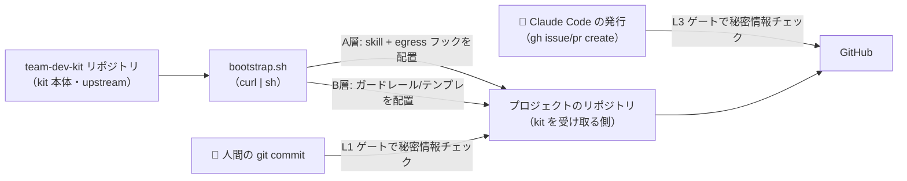
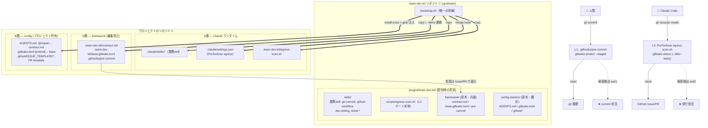
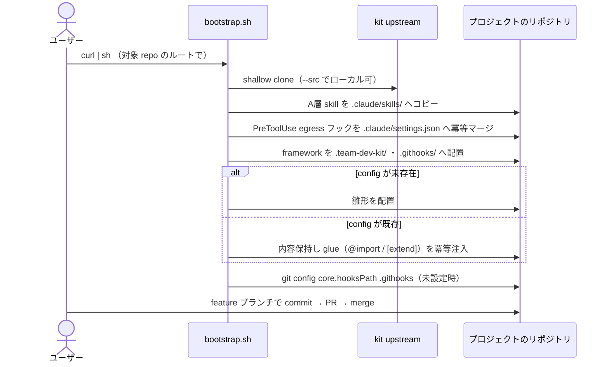
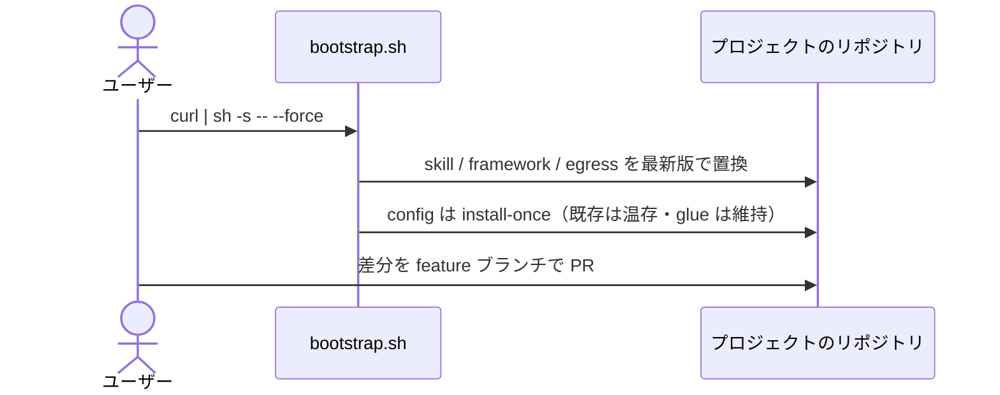
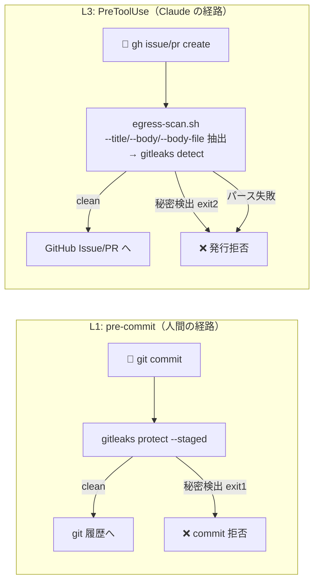

# team-dev-kit アーキテクチャ

チーム開発の **決まりごと（ルール・ワークフロー）と人為ミス排除のガードレール** を、Claude Code を前提に
多数のリポジトリへ配り、更新し、現場の改善を吸い上げる kit。本ドキュメントは設計全体像・構成要素・
データフローをまとめる。

## 1. 設計の狙い

- **オンボーディングの即時化** — ルールを知らない初心者が clone 直後からルール通りに開発を始められる
- **人為ミスの排除** — 秘密情報・個人情報の漏洩を、人間の `git commit`（pre-commit）と Claude の外部発行
  （PreToolUse フック）の二経路で機械的に止める
- **他プロジェクトへの非干渉** — 既定で導入物はすべて対象プロジェクト配下に置き、`$HOME` を汚さない

## 2. 配り方: 単一のブートストラップ

kit は **`bootstrap.sh` を唯一の導入/更新導線**とする。対象リポジトリのルートで `curl | sh` すると、
kit 本体（upstream）から必要なファイルを取得し、**そのプロジェクト配下にだけ**配置する。

```bash
# プロジェクトローカル導入（既定。$HOME に何も置かない）
curl -fsSL https://raw.githubusercontent.com/aRaikoFunakami/team-dev-kit/main/bootstrap.sh | sh

# 明示的に全プロジェクトで使う場合のみ skill を $HOME 配下へ
curl -fsSL .../bootstrap.sh | sh -s -- --global
```

plugin marketplace 方式を採らない理由: marketplace は skill 実体を `~/.claude/plugins` に登録し、有効化も
`~/.claude/settings.json` に入りがちで、**他プロジェクトへ干渉する**。また「skill を有効化しないと導入
コマンドが呼べない」ブートストラップの循環も生む。bootstrap は shell から直接走るためこの循環がなく、
配置物はすべてリポジトリ配下に commit される。更新は **bootstrap の再実行**（最新を取得して置換）で行う。

## 3. いちばん大事な考え方: 2つの層（A層・B層）

bootstrap が配るものは、効かせる相手で **2つの層** に分かれる。両方ともプロジェクトのリポジトリに
commit されるが、**誰に効かせるか**が違う。

| | A層（Claude Code に効かせる） | B層（人間の `git commit`・GitHub に効かせる） |
|---|---|---|
| 中身 | skill（`.claude/skills/`）+ PreToolUse egress フック（`.claude/settings.json` + `.team-dev-kit/egress-scan.sh`） | framework（共通・編集禁止）+ config（プロジェクト所有） |
| 効かせる相手 | Claude Code（条件発火で手続きを適用） | 人間の `git commit`（pre-commit）・GitHub（Issue/PR テンプレ） |
| 配置 | bootstrap がコピー | bootstrap がコピー |
| 更新 | bootstrap 再実行で置換 | framework=再実行（`--force`）で置換 / config=install-once |

A層は「Claude に渡す指示書」、B層は「人間の commit と GitHub に効くガードレール」。どちらも repo に
commit されるので、clone した全員に同じルールが届く。

### B層はさらに 2 種類: framework と config

B層の中身は「全員で共有して触らないもの（framework）」と「各プロジェクトが自由に書くもの（config）」に
分かれる。勝手に上書きしてよいか／ダメかが正反対だからである。

| | framework（共通・編集禁止） | config（プロジェクトが書く・install-once） |
|---|---|---|
| 所有 | kit | プロジェクト |
| 編集 | 禁止（契約違反） | 期待・推奨 |
| 更新 | bootstrap 再実行（`--force`）が**置換** | bootstrap は再配置しない（既存があれば glue のみ注入） |
| 還元 | 本体リポジトリへ Issue / PR | 還元しない（プロジェクト固有） |
| 例 | `contract.md`, `base.gitleaks.toml`, `pre-commit` | `AGENTS.md`, `.gitleaks.toml`, `.github/*` |

framework と config を裏でつなぐ仕組み（**glue＝のりづけ役**）は、読む相手によって 2 通り使い分ける:

- **`@import`**（agent 向け契約）: `AGENTS.md` が `@.team-dev-kit/contract.md` を取り込む
- **`[extend].path`**（gitleaks）: `.gitleaks.toml` が `.team-dev-kit/base.gitleaks.toml` を extend

**既存の独自 `AGENTS.md` / `.gitleaks.toml` がある場合**、bootstrap は内容を保持したまま、この glue だけを
冪等注入する（無ければ追記・あれば温存）。これにより「ファイルは温存したのに共通契約や秘密ガードが
黙って効かない」事故を防ぐ。

## 4. 全体像

kit 本体（upstream）の `bootstrap.sh` が A層・B層の両方を対象リポジトリへ配置する。配置後、人間の commit と
Claude Code の発行はそれぞれ別のゲートで秘密情報をチェックされる。



## 5. 詳細ダイアグラム



## 6. 構成要素

### 6.1 upstream（`plugins/team-dev-kit/` = 配布物の真実）

bootstrap が読み取り、consumer へコピーする原本ツリー。

| パス | 役割 |
|------|------|
| `skills/` | 業務 skill（Claude Code への指示書。実行コードは持たない。条件発火） |
| `scripts/egress-scan.sh` | L3 ゲート本体。`gh issue/pr create` の本文を gitleaks で検査 |
| `framework/` | B層に配る共通ファイルの**原本**（consumer 側では編集禁止） |
| `config-starters/` | B層に 1 回だけ置く雛形の**原本**（置いた後は consumer が所有） |

`bootstrap.sh`（リポジトリ直下）は導入/更新の唯一のエントリ。`skills/` を走査し `kit-*` を除外して配る
（固定リストにすると skill 追加を取りこぼすため）。

### 6.2 consumer 側に配置されるファイル

| 配置先 | 層 | 由来 | 更新 |
|--------|----|------|------|
| `.claude/skills/*` | A | `skills/*` | 再実行（`--force` で置換） |
| `.claude/settings.json`（PreToolUse） | A | bootstrap が生成/マージ | 冪等マージ |
| `.team-dev-kit/egress-scan.sh` | A | `scripts/egress-scan.sh` | 再実行で置換 |
| `.team-dev-kit/contract.md` | B/framework | `framework/contract.md` | `--force` 置換 |
| `.team-dev-kit/base.gitleaks.toml` | B/framework | `framework/base.gitleaks.toml` | `--force` 置換 |
| `.githooks/pre-commit` | B/framework | `framework/pre-commit`（+x） | `--force` 置換 |
| `AGENTS.md` | B/config | `config-starters/AGENTS.md` | install-once（既存は glue 注入のみ） |
| `.gitleaks.toml` | B/config | `config-starters/gitleaks.toml` | install-once（既存は glue 注入のみ） |
| `.github/ISSUE_TEMPLATE/*`, `PULL_REQUEST_TEMPLATE.md` | B/config | `config-starters/github/*` | install-once |

> version 追跡（lockfile）は持たない。更新は「最新を取得して置換」で完結し、framework のローカル改変は
> `--force` を付けない限り保持される（誤って消さないため）。

## 7. データフロー

### 7.1 導入（初回 / 既存プロジェクト）



### 7.2 更新（framework / skill）



`--force` を付けなければ既存 framework は温存（ローカル改変保護）。最新化したいときだけ `--force`。

### 7.3 還元（現場改善の upstream 反映）

framework のローカル改善は **本体リポジトリへ Issue / PR** で還元する（config はプロジェクト固有のため対象外）。
マージ後、各プロジェクトが bootstrap を再実行すれば改善が伝播する。

### 7.4 秘密情報スキャン 2 ゲート (L1 / L3)

検出ルールは両ゲートとも gitleaks + `.gitleaks.toml`（`base.gitleaks.toml` を extend）で共通。



**L3 が必要な理由**: ドラフト置き場 `.issue_drafts/` は git-ignore（履歴に乗らない）ため L1 では見えない。
`gh` 発行は L3 が唯一のゲート。パース失敗時は fail-closed（exit 2）で漏洩を防ぐ。

## 8. ライフサイクル一覧

| フェーズ | A層 | B層 | ゲート |
|---------|---------|---------|--------|
| 導入 | bootstrap が `.claude/skills/` + egress フックを配置 | bootstrap が framework/config を配置 + `core.hooksPath` | PR |
| 運用 | skill 自動発火・egress フック | git pre-commit が秘密情報を止める | PR テンプレ |
| 更新 | bootstrap 再実行（`--force` で置換） | framework は `--force` 置換・config は不可侵 | PR |
| 還元 | — | framework 改善を本体へ Issue / PR | PR |

更新も還元も **PR が唯一のレビュー境界**。プロジェクト間の直コピーは禁止。

## 9. 技術スタック

| 構成要素 | 言語 | 用途 |
|---------------|------|------|
| `bootstrap.sh` | Shell + Python 3 | 導入/更新エンジン（取得・配置・settings.json マージ・glue 注入） |
| `egress-scan.sh` | Shell + Python 3 | L3 フック（JSON 入力解析・本文抽出・gitleaks 実行） |
| `pre-commit` | Shell | L1 フック（`gitleaks protect --staged`） |
| skill（`SKILL.md`） | Markdown | Claude Code への振る舞い指示（実行コードなし） |
| `tests/smoke.sh` | Shell | bootstrap の全ライフサイクル E2E |
| 設定/テンプレ | TOML / JSON / Markdown / YAML | `.gitleaks.toml`, `settings.json`, 各テンプレ |

**外部依存**: `gitleaks`（秘密/個人情報スキャン）, `git`, `python3`, `gh`（Issue/PR 発行）

## 10. 主要ロジックのファイル参照

| ロジック | ファイル | 概要 |
|---------|---------|------|
| 導入/更新 | `bootstrap.sh` | 取得・配置・settings.json マージ・core.hooksPath 設定 |
| skill 配布（kit-* 除外） | `bootstrap.sh`（`SKILLS` 走査ループ） | `skills/*` を走査し `kit-*` を除外して配置 |
| config への glue 注入 | `bootstrap.sh`（`ensure_glue`） | 既存 `AGENTS.md`/`.gitleaks.toml` に `@import`/`[extend]` を冪等注入 |
| settings.json マージ | `bootstrap.sh`（PreToolUse マージ） | 壊れた JSON は fail-safe で追記スキップ |
| L3 発行ゲート | `plugins/team-dev-kit/scripts/egress-scan.sh` | `gh ... create` の本文を gitleaks にかける |
| L1 commit ゲート | `plugins/team-dev-kit/framework/pre-commit` | `gitleaks protect --staged` |
| base 検出ルール | `plugins/team-dev-kit/framework/base.gitleaks.toml` | 秘密＋個人情報ルール（L1/L3 の源） |
| `@import` glue | `plugins/team-dev-kit/config-starters/AGENTS.md` | `@.team-dev-kit/contract.md` |
| `[extend]` glue | `plugins/team-dev-kit/config-starters/gitleaks.toml` | `path = ".team-dev-kit/base.gitleaks.toml"` |
| E2E テスト | `tests/smoke.sh` | 導入→glue→L1/L3→冪等→--force→既存 config 注入→fail-safe→--global |

## 11. ステータス

bootstrap 一本化済（plugin marketplace / kit-* skill / kit-sync.py は撤去）。
framework/config 分離・`@import`・gitleaks overlay→base 継承・既存 config への glue 冪等注入を実装。
検証は `sh tests/smoke.sh`（全アサーション通過）。
